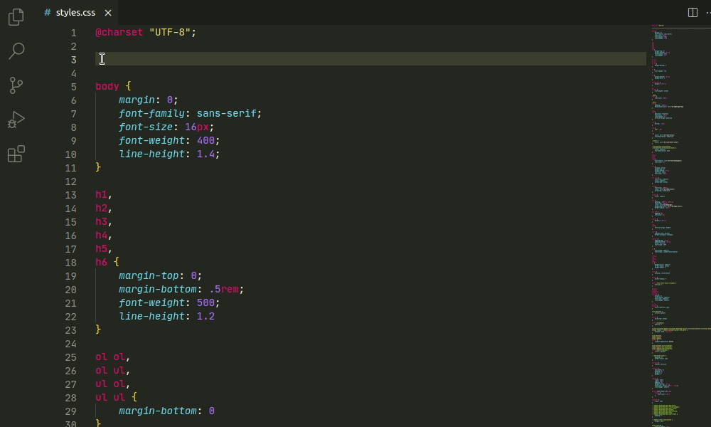

# Webfont

Import and download fonts from the [Fontstorage.com](https://fontstorage.com/) collection. 

## Features

* Search by font name in the Fontstorage collection right from the editor.
* Insert font import.
* Download fonts from the Fontstorage website.
* Open Fontstorage webside to make a subset copy of the selected font.

## Usages

Open the context menu in *.css/scss/sass/less/styl or html files. Click the "Webfont" menu item and choose or search a font. 
Then you can import it, download as ttf/otf or subset using the converter on the Fontstorage website.

## Issues

Submit the [issues](https://github.com/WebFont/webfont_vscode/issues) if you have found any bugs or have any suggestions.
